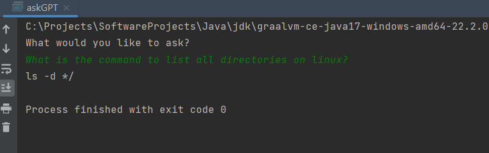
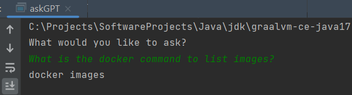
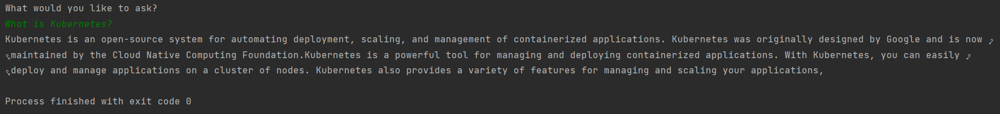

# AskGPT - Java CLI + ChatGPT API

============================================================
## Project Summary
A convenient 🏪 and quick 🚀 command line tool which answers your queries right in your terminal! The tool is powered using OpenAI and uses the ChatGPT completion endpoint to quickly answer any questions you may have. You could practically ask anything from descriptions of the latest technologies to hard-to-remember commands, all in the warm 🔥 comfort of your terminal!

### Example Usage
What is the command to list all directories on linux?

What is the docker command to list images?

What is Kubernetes?

**The capabilities are endless, Try it out for yourself now!**

## Getting Started 👟
*Note: Some features may be limited to linux OS driven machines*
### Project requirements
#### Minimum Java and Maven versions
- GraalVM v17.0.4
- Maven v3.0.0+

#### Dependency list

| Dependencies        |
|:--------------------|
| dotenv              |
| jackson-core        |
| jackson-annotations |
| jackson-databind    |

### Prerequisites
- OpenAI API Key
- Git
- GraalVM
- Maven
- IDE (preferably IntelliJ)

### Setting up the Project 🔧
Within your terminal input the following commands.
1. Clone the project using `git clone https://github.com/hsnnkb-dev/AskGPT.git` .
2. `cd` into the root of the project.

### Connecting your API Key 🔑
These instructions should allow you to connect your API key and run the project locally.
You can find your API key on your personal OpenAI account page.
1. Create environment variable files `.env` the root of the project.
2. Within `.env` write "OPENAI-API-KEY=<YOUR-API-KEY-HERE>" (No Quotations and brackets).
3. Ensure that `.env` is present in the `.gitignore` file.

### Running the Project 🏃🏻
A Native executable image can be created with a tracing agent if you are on a linux machine.
1. Run the main class of "AskGPT.java".
2. Ask away in the terminal and wait for a response.

Additionally, you can create a native executable and alias the resulting package for added convenience.

## Next Steps & Contact Me 🎉
Hopefully, the project should be up and running, and you should be free to do whatever you would like with it. Give me a shout 🗣️ at hsnnkb.dev@gmail.com 📫!